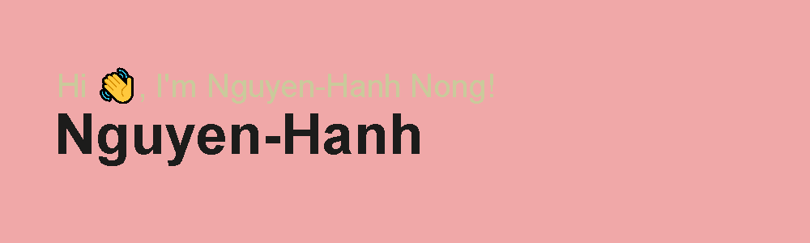

# Hello, world! 

My name is Nguyen-Hanh Nong and I'm a Second-Year Computer Science student at Carleton University. I am from Canada and currently full-time in school. You can find me on [LinkedIn][1.1].

## 💻 OS

## 🔧 Technologies and Frameworks

## Github Stats

<!-- links to social media icons -->

<!-- icons without padding -->

[1.1]: https://raw.githubusercontent.com/MartinHeinz/MartinHeinz/master/linkedin-3-16.png (LinkedIn icon without padding)
[2.1]: https://upload.wikimedia.org/wikipedia/commons/1/19/LeetCode_logo_black.png

<!-- links to your social media accounts -->

[1]: https://www.linkedin.com/in/nguyen-hanh-nong/
[2]: https://leetcode.com/nguyenhanhnong/

