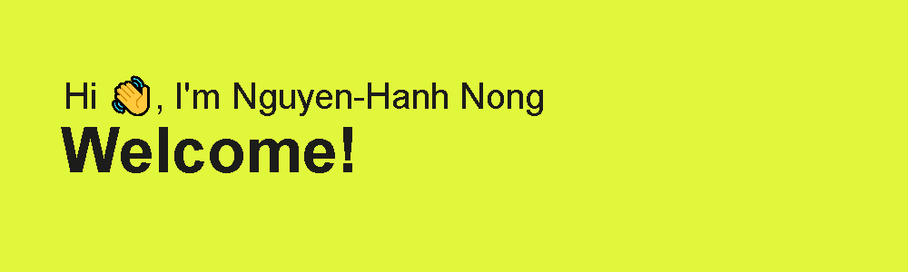

# Hello, world! 

My name is Nguyen-Hanh Nong and I'm a First-Year Computer Science student at Carleton University. I am from Canada and currently full-time in school. You can find me at
[![LinkedIn][3.2]][3].

## 💻 OS

## 🔧 Technologies and Frameworks

